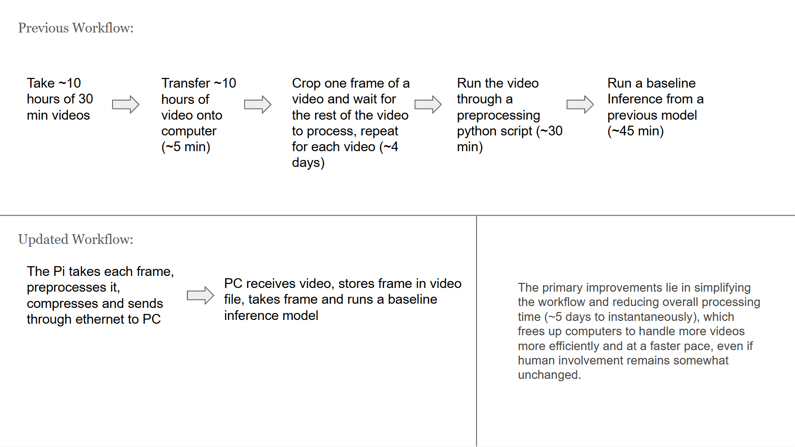

# 🐜 AI-Powered Termite Tracking System

This system automates termite behavior tracking in real time using a Raspberry Pi camera module and deep learning inference via SLEAP. Designed for laboratory studies, it significantly reduces the time and human error involved in analyzing termite movements by tracking individuals and key body parts automatically.

## 🔍 Key Features

- Real-time video streaming from Raspberry Pi
- PyQt5 GUI for video preview, file path config, and run control
- SLEAP-based keypoint inference pipeline
- Live preview of overlayed inference
- JSON + video export for later analysis
- Hardware integration: camera, lights, buttons

## 🖼️ System Overview



1. Raspberry Pi captures and streams MJPEG video
2. PC receives and buffers video, runs inference
3. Real-time annotated display with export options

## 🧠 Technologies Used

| Component           | Tech                             |
|---------------------|----------------------------------|
| Embedded Hardware   | Raspberry Pi 4 B (8GB), Pi Camera |
| Video Streaming     | `libcamera-vid`, TCP sockets      |
| GUI & Frontend      | PyQt5                             |
| Pose Estimation     | [SLEAP](https://sleap.ai)         |
| Data Export         | JSON, MP4, slp                    |

## 🛠️ Setup Instructions

### Raspberry Pi

1. Flash Raspberry Pi OS
2. Enable camera and SSH
3. Follow setup steps in [`hardware/raspberry_pi_setup.md`](hardware/raspberry_pi_setup.md)

### PC

1. Clone this repo
2. Install dependencies:

```bash
pip install -r requirements.txt
